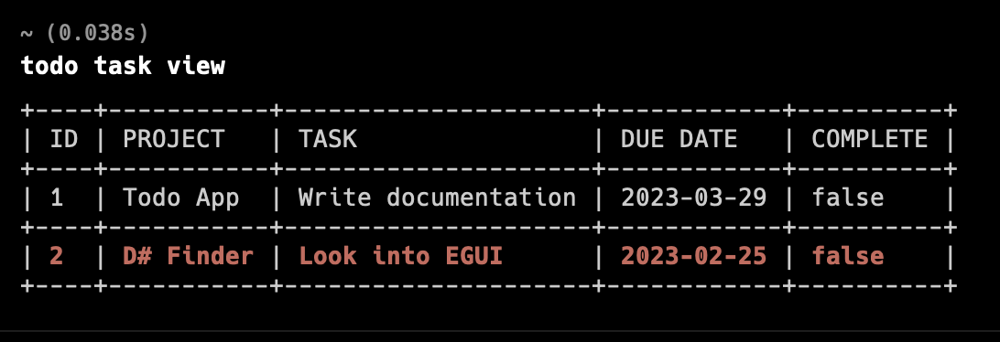

# TODO CLI Application
This application is meant to be a command line interface application that allows
the user to add and remove tasks based on projects, it will also be possible to
set a due date and view tasks.

## Installation
Clone the repository to your working directory. Open a terminal/cmd and build the source code with cargo:  
`cargo build --release`  
Add the release folder (in the target folder) to your path. The program will now run from any shell.
Alternatively, run the following command to build and install to your path:  
`cargo install --path`  

## How to use
For information on the various parameters and flags run the following:  
`todo --help`  
You can get further help on each of the flags by specifiying the command and the help flag e.g.  
`todo task --help`  
`todo task add --help`, etc...  

### Quick Start
To add a task type:
`todo task add -t "task goes here"`, you can add various flags and options  
Options:  
  -p, --project <PROJECT>    Project name [default: General]  
  -t, --task <TASK>          Task description  
  -d, --due-date <DUE_DATE>  Due date in format 'YYYY-MM-DD' [default: 2023-03-29]  
  -c, --complete             Status  
  -h, --help                 Print help  

For example:
`todo task add -t "buy apples" -p "food" -d "2023-12-12"` will add the task "buy apples" to your list with a project titled "food" and due date of "2023-12-12". You must specify the flags when there is no default value. It is also important to match the format for the date, there will be parsing errors when trying to view the data if you type it incorrectly.  
The tasks which are overdue will be marked bold in red.  

